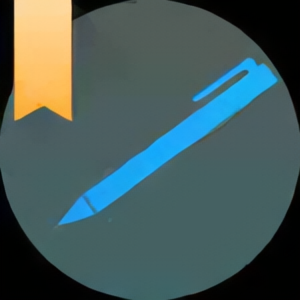
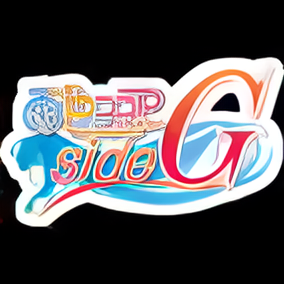
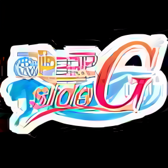
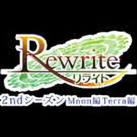
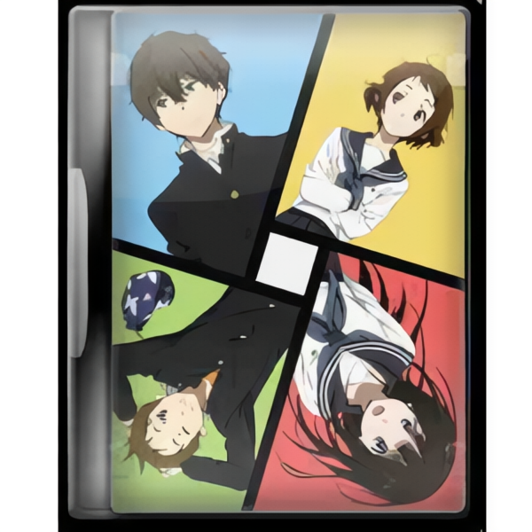
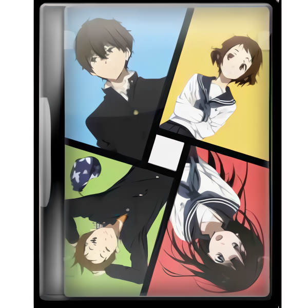
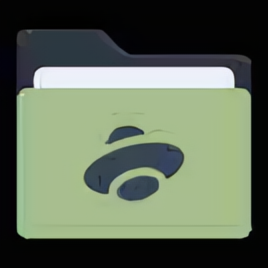
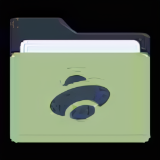

## 2x_iconsV1_RealPLKSR vs. Other Open Models

\*also see [2x_iconsV1_RealPLKSR vs. Topaz Gigapixel](https://github.com/Courage-1984/My-Upscale-Models/tree/main/2x_iconsV1_RealPLKSR/examples/comparisons/topaz%20gigapixel)

## Results:

| lq input                                        | 2x iconsV1 RealPLKSR                             | 2x AnimeSharpV4 RCAN                                                 | 4x IllustrationJaNai V1 DAT2 190k                                                 |
| ----------------------------------------------- | ------------------------------------------------ | -------------------------------------------------------------------- | --------------------------------------------------------------------------------- |
|  |  |  |  |
|  |  |  |  |
|  |  |  |  |
|  |  |  |  |
|  |  |  |  |
|  |  |  |  |
|  |  |  |  |
|  |  |  |  |
|  |  |  |  |
|  |  |  |  |
|  |  |  |  |
