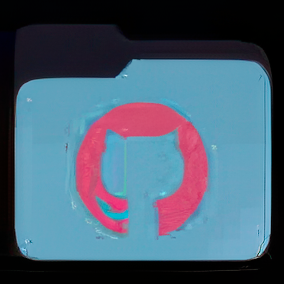
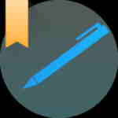
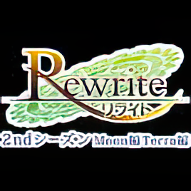
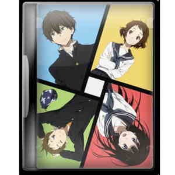
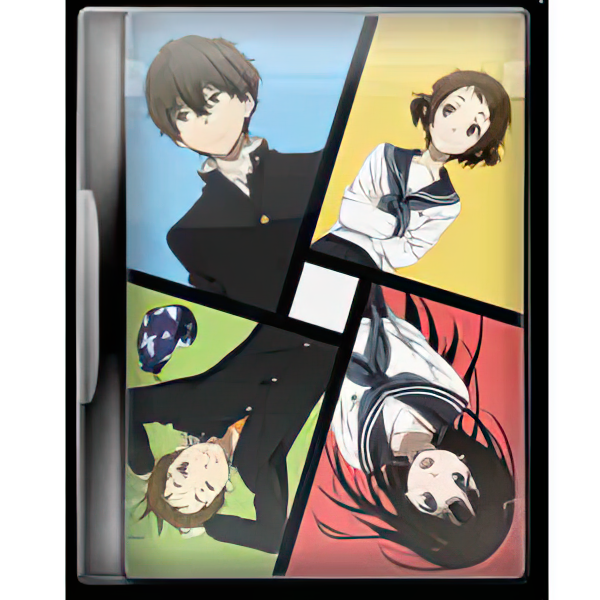
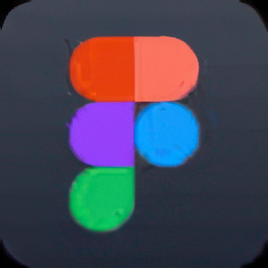
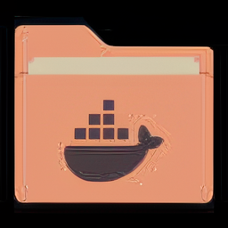
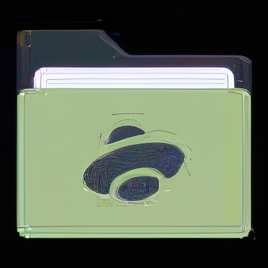
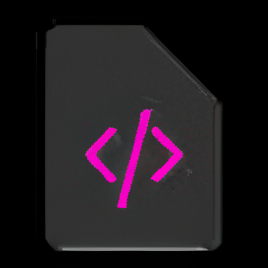
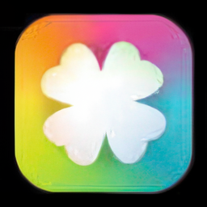

## 2x_iconsV1_RealPLKSR vs. Topaz Gigapixel

## Results:

| lq input                                 | 2x iconsV1 RealPLKSR                      | gigapixel-standard v2-2x                                          | gigapixel-low resolution v2-2x                                          | gigapixel-text-shapes-2x                                          | gigapixel-cgi-2x                                          | gigapixel-recover v2-2x                                          |
| ---------------------------------------- | ----------------------------------------- | ----------------------------------------------------------------- | ----------------------------------------------------------------------- | ----------------------------------------------------------------- | --------------------------------------------------------- | ---------------------------------------------------------------- |
|  |  |  |  |  |  |  |
|  |  |  |  |  |  |  |
|  |  |  |  |  |  |  |
|  |  |  |  |  |  |  |
|  |  |  |  |  |  |  |
|  |  |  |  |  |  |  |
|  |  |  |  |  |  |  |
|  |  |  |  |  |  |  |
|  |  |  |  |  |  |  |
|  |  |  |  |  |  |  |
|  |  |  |  |  |  |  |
